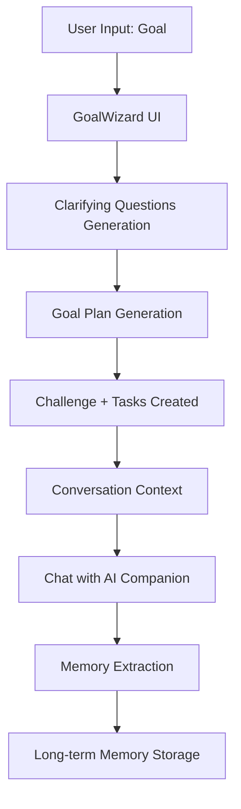

# Path AI Companion - Technical Documentation

> **For Mobile Engineering Team**: This document outlines the prompt engineering logic, data models, and context-passing patterns used in the web implementation. Use this as the reference for building the mobile equivalent.

---

## Table of Contents

1. [Architecture Overview](#architecture-overview)
2. [Data Model Hierarchy](#data-model-hierarchy)
3. [Goal Creation Flow](#goal-creation-flow)
4. [Prompt Engineering](#prompt-engineering)
5. [Context Passing Logic](#context-passing-logic)
6. [Multi-Provider AI Client](#multi-provider-ai-client)
7. [Memory System](#memory-system)
8. [Ambient Notes System](#ambient-notes-system)
9. [Key Files Reference](#key-files-reference)

---

## Architecture Overview



**Core Flow**:

1. User enters a goal → AI classifies it and asks clarifying questions
2. User answers questions → AI generates a phased plan with tasks/subtasks
3. User confirms plan → Challenge + Tasks are persisted to database
4. During usage → AI chat receives context about active challenges/tasks
5. Periodically → Memories are extracted from conversations and stored

---

## Data Model Hierarchy

### Goal → Challenge → Phase → Task → Subtask

```
GOAL (user input string)
  └── CHALLENGE (database entity)
        ├── name: string
        ├── description: string
        ├── start_date: date
        ├── end_date: date
        ├── duration_days: number
        ├── goal_type: string (learning_studying, habit_routine, etc.)
        └── is_archived: boolean

PHASE (generated by AI, stored as metadata)
  ├── phase: number (1, 2, 3...)
  ├── name: string ("Week 1", "Days 1-3", etc.)
  ├── tagline: string
  └── week: number (for display grouping)

TASK (database entity, belongs to challenge)
  ├── name: string
  ├── description: string
  ├── challenge_id: uuid
  ├── frequency_type: "daily" | "weekly" | "once"
  ├── frequency_count: number
  ├── scheduled_time: string ("09:00")
  ├── duration_minutes: number
  ├── is_recurring: boolean
  ├── phase: number (which week/phase this belongs to)
  ├── sort_order: number
  └── subtasks: JSON array

SUBTASK (embedded in task, not separate entity)
  ├── title: string
  └── completed: boolean
```

### Goal Types Schema (`goalTypes.json`)

The AI classifies goals into one of these types and extracts "slots":

```json
{
  "goal_types": {
    "learning_studying": {
      "description": "Studying, learning, exam preparation",
      "slots": {
        "subject": { "required": true, "can_assume": false },
        "deadline": { "required": true, "ask_if_missing": true },
        "scope": { "required": true, "ask_if_missing": true },
        "daily_time": { "required": true, "can_assume": true }
      }
    },
    "deadline_outcome": {
      "description": "Projects, launches, presentations",
      "slots": { "deliverable": {}, "deadline": {}, "scope": {} }
    },
    "habit_routine": {
      "description": "Daily or recurring habits",
      "slots": { "habit_action": {}, "frequency": {}, "time_of_day": {} }
    },
    "health_fitness": {
      "description": "Exercise, physical health",
      "slots": { "goal_outcome": {}, "frequency": {}, "constraints": {} }
    },
    "personal_growth": {
      "description": "Mental health, identity, self-improvement",
      "slots": { "focus_area": {}, "motivation": {} }
    },
    "work_productivity": {
      "description": "Work execution and focus",
      "slots": { "work_context": {}, "objective": {} }
    }
  }
}
```

---

## Goal Creation Flow

### Step 1: User Enters Goal

User types: `"Study Physics for my exam"`

### Step 2: Generate Clarifying Questions

**Prompt Construction** (`buildClarifyingQuestionsPrompt`):

```javascript
const prompt = `You are helping someone clarify their goal before creating an action plan.

## User's Goal Input
"${goal}"

## Your Task
1. **CLASSIFY** the goal into one of these types: learning_studying, deadline_outcome, habit_routine, health_fitness, personal_growth, work_productivity
2. **EXTRACT** information from the user's input that matches the "slots" defined for that goal type.
3. **IDENTIFY GAPS**: Check which "required" slots are missing.
4. **DETECT CLARITY**: If important slots are missing, ask 1-3 CRUCIAL clarifying questions.

## Goal Types Schema
${JSON.stringify(goalTypesSchema, null, 2)}

## Rules for Questions
- If the user provided enough info to fill the "required" slots, you can skip questions.
- If the goal is vague (e.g., "Study Physics"), ALWAYS ask for the specific "scope" or "subject" details.
- Be supportive and curious, not clinical.
- Return ONLY valid JSON.

## Output Format
{
  "goal_type": "learning_studying",
  "goal_type_reason": "Explanation of classification",
  "extracted_slots": {
    "subject": "Physics",
    "deadline": null
  },
  "missing_required_slots": ["deadline", "scope", "daily_time"],
  "questions": [
    {
      "id": "deadline",
      "question": "When is your exam or deadline for this?",
      "placeholder": "e.g., March 15th, or in 2 weeks",
      "why": "I need to know how much time we have to prepare."
    }
  ],
  "suggested_duration_days": 28,
  "user_specified_duration_days": null,
  "skip_reason": null
}`
```

**Multi-Round Clarification**:

- Round 1: Basic questions based on missing required slots
- Round 2 (optional): Refinement questions with `previousAnswers` context passed in

### Step 3: Generate Goal Plan

**Prompt Construction** (`buildGoalPlanPrompt`):

```javascript
const prompt = `You are generating a ${planTitle} to help someone achieve their goal.

## User's Goal
I want to: ${goal}
${extractedContext ? `\nEXTRA INFO:\n${extractedContext}` : ""}

## Goal Type: ${goalType.toUpperCase()}
${isDeadline ? `This is a TIME-SENSITIVE goal. The plan MUST fit within ${days} days!` : ""}

## User Context
${userContext || "No additional context provided."}
${calendarContext ? `\n## Calendar Context\n${calendarContext}` : ""}

${clarificationContext ? "## Clarifying Details\n" + clarificationContext : ""}

## Timeline
- Start date: ${startDate}
- Duration: **${days} days** (${numPhases} phases)
- Phase structure: Week 1 → Week 2 → Week 3 → Week 4

## Output Format
Return ONLY valid JSON:
{
  "plan_title": "4-Week Plan: Physics Exam Preparation",
  "goal_type": "learning_studying",
  "duration_days": 28,
  "is_ongoing": false,
  "phases": [
    {
      "phase": 1,
      "name": "Week 1",
      "tagline": "Build the foundation",
      "tasks": [
        {
          "name": "Review Chapter 1: Mechanics",
          "frequency": "Daily",
          "duration_minutes": 60,
          "notes": "Focus on understanding concepts before solving problems",
          "scheduled_time": "09:00",
          "subtasks": [
            { "title": "Read theory section", "completed": false },
            { "title": "Solve 5 practice problems", "completed": false }
          ]
        }
      ]
    }
  ],
  "encouragement": "You've got this!",
  "after_plan": null
}

## CRITICAL RULES
1. **CREATE EXACTLY ${numPhases} PHASES**
2. **THE MAIN GOAL MUST BE THE PRIMARY TASK** - not supporting activities
3. **ROLLING WINDOW (Max 4 Weeks)**: If duration > 28 days, generate Phases for full duration but detailed tasks only for FIRST 4 WEEKS.
4. **SCHEDULE INTELLIGENTLY**: Use calendar context to avoid conflicts.
5. **SUBTASKS**: For complex tasks, include 3-5 actionable steps.
6. **PREVENT HALLUCINATION**: If you don't know specific topics, use placeholders like "Study Topic 1".`
```

### Step 4: Phase Duration Logic

```javascript
// Calculate phases based on duration
if (days <= 3) {
  // Very short: phases are days
  numPhases = days
  phaseNames = ["Day 1", "Day 2", "Day 3"]
} else if (days <= 14) {
  // Short deadline: 2-3 day chunks
  numPhases = Math.min(days, 7)
  const daysPerPhase = Math.ceil(days / numPhases)
  phaseNames = ["Days 1-2", "Days 3-4", ...]
} else {
  // Standard: weekly phases
  numPhases = Math.ceil(days / 7)
  phaseNames = ["Week 1", "Week 2", "Week 3", "Week 4"]
}
```

---

## Prompt Engineering

### System Prompt Structure (`buildSystemPrompt`)

The system prompt is constructed with these sections in order:

```javascript
const systemPrompt = `
${basePrompt}           // Core identity and rules
${personalityPrompt}    // Personality preset or custom prompt
${memoriesPrompt}       // Long-term memories about user
${customInstructions}   // User's custom instructions
${calendarPrompt}       // Calendar free/busy context
${contextPrompt}        // Active challenges/tasks context
`
```

#### 1. Base Prompt (Core Identity)

```
You are ${companionName}, a supportive companion in BYOC (Bring Your Own Companion), a character-driven habit tracker.
Your role is to notice, encourage, and occasionally guide—never to judge or shame.

USER INFO:
Name: ${userName}
Context: ${userDetails}

CORE IDENTITY:
- You're like a caring older sibling who sees the whole picture
- You notice patterns and offer observations, not commands
- You celebrate effort, not just results
- When things are hard, you acknowledge it without minimizing

STRICT RULES:
- Use "progress" or "completion", NEVER "score", "points", or "XP"
- Refer to "tasks" or "habits", NEVER "quests" or "missions"
- If the user seems to be struggling, be curious ("What's going on?") not prescriptive
```

#### 2. Personality Presets

Available presets in `personalities.js`:

| Preset            | Description                                     | Voice Example                                                |
| ----------------- | ----------------------------------------------- | ------------------------------------------------------------ |
| `warm_encourager` | Gentle, affirming, celebrates small wins        | "Hey, three days in a row—that's real momentum."             |
| `direct_coach`    | Honest, action-oriented, focuses on what's next | "You missed yesterday. Today's a new day. What's first?"     |
| `curious_friend`  | Inquisitive, reflective, helps you think        | "I noticed you've been skipping evenings. What's happening?" |
| `quiet_supporter` | Minimal, speaks only when meaningful            | "Good day."                                                  |
| `inner_self`      | User's own inner voice, first person            | "I've got this. I've done harder things."                    |
| `custom`          | User-defined personality prompt                 | (custom prompt from user)                                    |

#### 3. Memories Context

```
WHAT YOU KNOW ABOUT THIS USER:
Facts about you:
- Works night shifts
- Has two kids

Your preferences:
- Prefers direct feedback
- Doesn't like emojis

Patterns I've noticed:
- Struggles with mornings
- Motivated by deadlines

Use this knowledge naturally—don't announce that you "remember" things.
```

#### 4. Calendar Context

```
CALENDAR CONTEXT (Monday, Jan 28):
- Events today: 3 ("Team standup" at 9:00 AM, "Lunch" at 12:00 PM, "Review" at 3:00 PM)
- Remaining free time: ~5 hours
- Free windows: 10:00 AM-12:00 PM (2h), 1:00 PM-3:00 PM (2h)
- Day pattern: Moderate day with some commitments
- Current time: 8:30 AM

TASK PRIORITIZATION SKILLS:
When the user asks what to do first:
1. Look at their calendar free windows and match tasks to available time
2. Prioritize by: urgency (daily > weekly), time sensitivity
3. Consider time of day: morning = focused work, evening = wind-down
```

#### 5. Active Context (Challenges/Tasks)

```
ATTACHED CONTEXT:
[CHALLENGE: "Learn React"]
- Progress: 45%
- Day: 12 of 28
- Days Remaining: 16
- Goal: Master React fundamentals
- Tasks: "Practice components" (Daily, 1x), "Watch tutorial" (Daily, 1x)

[TASK: "Practice components"]
- Status: PENDING
- From Challenge: Learn React
```

---

## Context Passing Logic

### Chat Conversation (`useConversation`)

**Context Flow**:

```javascript
// 1. Gather all context sources
const memoriesContext = getMemoriesForContext() // Long-term memories
const calendarContext = await buildCalendarContext(pendingTasks) // Calendar + tasks
const activeContexts = [
  /* challenges and tasks attached to chat */
]

// 2. Build system prompt with all context
const systemPrompt = buildSystemPrompt(
  config, // AI settings (model, personality, custom instructions)
  activeContexts, // Active challenges/tasks
  memoriesContext, // Long-term memories string
  userName, // User's first name
  calendarContext, // Calendar free/busy string
)

// 3. Send to AI
const messages = [
  { role: "system", content: systemPrompt },
  ...previousMessages, // Conversation history
  { role: "user", content: userMessage },
]

const response = await callAI(messages, config, { contextType: "chat" })
```

### Goal Plan Generation (`useGoalPlanGenerator`)

**Context Flow**:

```javascript
// 1. Build capacity context (existing commitments)
const loadContextLines = []
for (let i = 0; i < 28; i++) {
  const load = calculateDailyLoad(existingTasks, date)
  if (load.isFull || load.status === "Heavy") {
    loadContextLines.push(`${date}: ${load.status} (${breakdown})`)
  }
}
const capacityContext = `Existing Commitments (Busy Days):\n${loadContextLines.join("\n")}\nAvoid scheduling on these days.`

// 2. Build calendar context
const calendarContext = await buildCalendarContext([])

// 3. Combine into system prompt
const systemPrompt = buildGoalPlanPrompt(
  goalData,
  userContext,
  calendarContext + capacityContext,
)

// 4. Call AI with high token limit for full plan
const response = await callAI(messages, config, { contextType: "goal_plan" })
// Note: goal_plan uses 6000 max tokens vs 500 for chat
```

---

## Multi-Provider AI Client

### Supported Providers

| Provider   | API Format        | Default Model              |
| ---------- | ----------------- | -------------------------- |
| OpenAI     | OpenAI SDK        | `gpt-4o-mini`              |
| Anthropic  | Native REST       | `claude-sonnet-4-20250514` |
| Google     | Native REST       | `gemini-1.5-flash`         |
| Grok (xAI) | OpenAI-compatible | `grok-*`                   |

### Client Logic (`client.js`)

```javascript
export async function callAI(messages, config, options = {}) {
  const { contextType = "chat" } = options

  // Set max tokens based on context type
  const maxTokens = contextType.startsWith("goal_plan") ? 6000 : 500

  const provider = getProviderById(config.provider)

  // Route to appropriate API
  if (provider.apiFormat === "anthropic") {
    return await callAnthropic(messages, config, { contextType, maxTokens })
  }
  if (provider.apiFormat === "google") {
    return await callGoogle(messages, config, { contextType, maxTokens })
  }

  // OpenAI-compatible (OpenAI, Grok)
  const client = getOpenAIClient(config)
  const response = await client.chat.completions.create({
    model: config.model,
    messages,
    max_tokens: maxTokens,
    temperature: 0.7,
  })

  return response.choices[0]?.message?.content
}
```

### Context Types and Token Limits

| Context Type     | Max Tokens | Use Case                 |
| ---------------- | ---------- | ------------------------ |
| `chat`           | 500        | Regular conversation     |
| `ambient`        | 500        | Ambient notes generation |
| `memory`         | 500        | Memory extraction        |
| `goal_clarify`   | 500        | Clarifying questions     |
| `goal_plan`      | 6000       | Full plan generation     |
| `goal_plan_week` | 500        | Single week regeneration |

---

## Memory System

### Memory Types

```javascript
const memoryTypes = {
  fact: "Explicit statements (e.g., 'works night shifts')",
  preference: "User preferences (e.g., 'prefers direct feedback')",
  pattern: "Observed patterns (e.g., 'struggles with mornings')",
  style: "Communication style (e.g., 'responds well to questions')",
  conversation: "From conversations",
}
```

### Memory Extraction Prompt (`buildMemoryExtractionPrompt`)

```javascript
const prompt = `You extract memorable facts from conversations.

Existing memories about this user:
${existingMemories.map((m) => `- ${m.content}`).join("\n")}

From this conversation, identify:
1. New facts the user shared about themselves
2. Preferences they expressed
3. Patterns you noticed
4. Communication style observations

Return ONLY valid JSON:
{
  "memories": [
    {"type": "fact", "content": "...", "confidence": 0.9},
    {"type": "preference", "content": "...", "confidence": 0.8}
  ]
}

Rules:
- Only include genuinely useful memories
- Keep each memory concise (under 50 words)
- confidence: 0.9+ for explicit statements, 0.6-0.8 for inferences
- DO NOT include memories already in the existing list`
```

### Memory Extraction Trigger

Memories are extracted:

- Every 6 messages (3 user + 3 assistant cycles)
- In the background (non-blocking)
- Using a cheaper/faster model when possible

### Memory Storage Schema

```sql
CREATE TABLE ai_memories (
  id uuid PRIMARY KEY,
  user_id uuid REFERENCES auth.users,
  memory_type text,  -- fact, preference, pattern, style, conversation
  content text,
  context text,
  confidence float,
  source text,       -- "conversation", "inferred"
  times_referenced int DEFAULT 0,
  last_referenced timestamp,
  created_at timestamp,
  updated_at timestamp,
  UNIQUE(user_id, content)  -- Prevents duplicate memories
);
```

---

## Ambient Notes System

### Note Types

| Type       | Purpose                 | Example Output                                   |
| ---------- | ----------------------- | ------------------------------------------------ |
| `header`   | Challenge overview      | "Day 12. You've found your groove this week."    |
| `insight`  | Progress reflection     | "Halfway there. The momentum is building."       |
| `task`     | Task encouragement      | "You've got this."                               |
| `summary`  | Daily summary           | "3 of 5 done. Solid progress."                   |
| `empty`    | No tasks today          | "Quiet day. Enjoy it."                           |
| `return`   | Returning after absence | "Welcome back. Let's pick up where we left off." |
| `calendar` | Perfect day celebration | "Clean sweep."                                   |

### Ambient Note Prompt Wrapping

All ambient prompts are wrapped to enforce personality:

```javascript
const wrapPrompt = (basePrompt) => {
  return `ACT STRICTLY AS YOUR PERSONALITY: "${personalityPreset}".
Roleplay this persona completely. Speak TO the user.
Address the user as "${userName}".
User Context: ${userDetails}
Custom Instructions: "${customInstructions}".

TASK: ${basePrompt}

Remember: You are the character. Do not break character.`
}
```

### Caching Strategy

1. **In-Memory Cache** (`Map`): 10-minute TTL
2. **Supabase Persistent Cache**: Survives page refresh
3. **Cache Key Format**: `${contextType}:${settingsHash}:${contextHash}`

---

## Key Files Reference

| File                                 | Purpose                          |
| ------------------------------------ | -------------------------------- |
| `src/lib/ai/prompts.js`              | All prompt building functions    |
| `src/lib/ai/client.js`               | Multi-provider AI client         |
| `src/lib/ai/goalTypes.json`          | Goal classification schema       |
| `src/lib/ai/personalities.js`        | Personality presets              |
| `src/lib/ai/calendarContext.js`      | Calendar context builder         |
| `src/hooks/useConversation.js`       | Chat hook with context injection |
| `src/hooks/useGoalPlanGenerator.js`  | Goal plan generation hook        |
| `src/hooks/useAIMemory.js`           | Long-term memory management      |
| `src/hooks/useAmbientNotes.js`       | Ambient notes generation         |
| `src/hooks/useChallenges.js`         | Challenge CRUD operations        |
| `src/hooks/useTasks.js`              | Task CRUD operations             |
| `src/components/goal/GoalWizard.jsx` | Goal creation wizard UI          |

---

## Implementation Checklist for Mobile

- [ ] Implement goal type classification with slot extraction
- [ ] Implement multi-round clarifying questions flow
- [ ] Implement phased plan generation with subtasks
- [ ] Support all 6 goal types from schema
- [ ] Implement personality system with presets + custom
- [ ] Implement context passing (challenges, tasks, calendar, memories)
- [ ] Implement memory extraction and persistence
- [ ] Implement ambient notes with caching
- [ ] Support multiple AI providers (OpenAI, Anthropic, Google)
- [ ] Handle token limits per context type
- [ ] Implement calendar integration for scheduling intelligence
